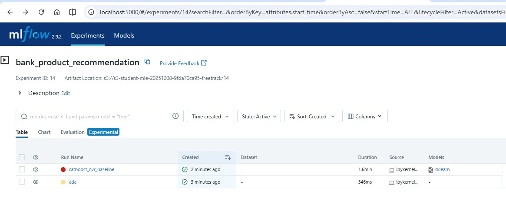
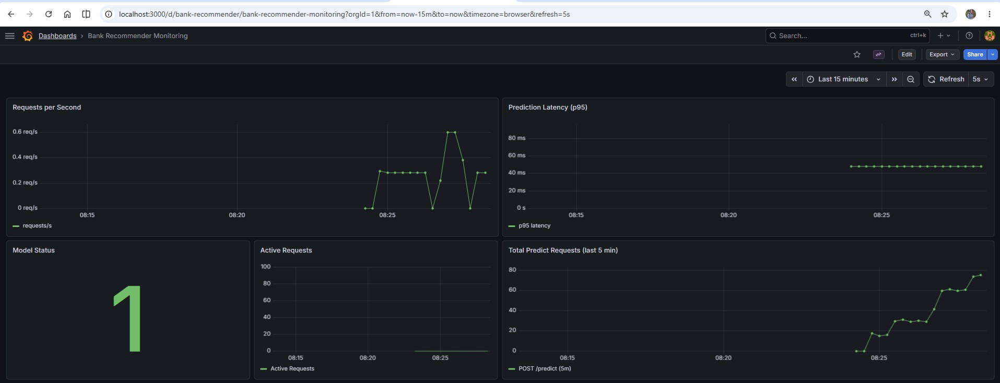

# Проект. Рекомендательная система в банковской сфере

## Цель

Предсказать, какие банковские продукты наиболее релевантны для клиента, и предложить их в виде персонализированной рекомендации.

## Основные задачи и артефакты

| Задача | Артефакты | Ссылки на артефакты |
|--------|-----------|---------------------|
| 1. Исследование данных. Проведите первичный анализ данных в Jupyter Notebook и опишите увиденные в них закономерности. | Jupyter Notebook с EDA. | [final_project.ipynb](final_project.ipynb) |
| 2. Подготовка инфраструктуры. Разверните MLflow с хранилищем артефактов. | .sh-скрипт с запуском и настройкой MLflow. | [mlflow_server/run_mlflow_server.sh](mlflow_server/run_mlflow_server.sh) |
| 3. Трансляция. Выберите метрики, на которые вы хотите повлиять, и решите, как будете решать задачу. | Описано в README.md | [Метрики и подход](#метрики-и-подход-к-решению) |
| 4. Моделирование. Проведите эксперименты. Подготовьте пайплайн обработки данных и построения модели. | Jupyter Notebook с проведением экспериментов, bin-файл модели. | [final_project.ipynb](final_project.ipynb), [app/model.bin](app/model.bin) |
| 5. Продуктивизация. Оберните модель в веб-сервис, чтобы она отвечала на запросы по API. Также сервис должен подниматься в Docker для удобства выкатки. | Python-пакет `app/`, Dockerfile, описание API. | [app/](app/), [Dockerfile](Dockerfile) |
| 6. Мониторинг. Проследите, чтобы все сервисы в продакшен-среде контролировались метриками. | .md-файл с описанием метрик. Метрики должны отправляться из кода проекта. | [monitoring.md](monitoring.md), [app/metrics.py](app/metrics.py) |
| 7. Документация. Самая важная часть — опишите процесс обработки данных, создания модели, её выкатки и сопровождения. | Заполненный README.md | Выполнено |
| 8. Требования и среда. Зафиксируйте случайные состояния и приложите зависимости, с которыми вы работали в рамках проекта. Важно соблюсти воспроизводимость экспериментов. | Сформированный файл requirements.txt | [requirements.txt](requirements.txt) |

## Стек технологий

| Категория | Инструменты |
|-----------|-------------|
| Анализ данных | Python, Pandas, NumPy, Matplotlib, Seaborn |
| Машинное обучение | Scikit-learn, CatBoost |
| Эксперименты | MLflow, Optuna |
| Веб-сервис | FastAPI, Uvicorn, Pydantic |
| Контейнеризация | Docker, Docker Compose |
| Мониторинг | Prometheus, Grafana (`prometheus_client`), см. [monitoring.md](monitoring.md) |

---

## Метрики и подход к решению

### Тип задачи

**Multi-label классификация** – клиент может получить несколько новых продуктов в следующем месяце (24 целевых продукта).

### Основная метрика

**MAP@7 (Mean Average Precision at 7)** – доля релевантных продуктов среди топ-7 рекомендаций, усреднённая по всем клиентам. Именно эта метрика использовалась в оригинальном соревновании Santander Product Recommendation.

### Дополнительные метрики

- **Recall@7** – полнота рекомендаций.
- **PR-AUC** – площадь под Precision-Recall кривой (учитывает дисбаланс классов).

### Подход

- **Time-based split** – обучение на данных 2016-01 и 2016-02, валидация на 2016-03, тест на 2016-04.
- **Модель** – `OneVsRestClassifier` с `CatBoostClassifier` (50 итераций, `auto_class_weights='Balanced'`).
- **Целевая переменная** – новые продукты в следующем месяце (вычитание текущих продуктов из будущих).
- **Признаки** – возраст, стаж, доход, пол, сегмент, тип занятости, канал привлечения (текущие продукты не использовались для ускорения).

### Результаты эксперимента

Обучение на срезе **2016 года, 30% клиентов** (~1.1M строк после формирования таргета «новый продукт в следующем месяце»). Модель: One-vs-Rest + CatBoost (50 итераций, 7 признаков без текущего портфеля). Эксперимент залогирован в MLflow (runs `eda`, `catboost_ovr_baseline`).

| Метрика | Validation | Test |
|---------|------------|------|
| MAP@7 | 0.3157 | 0.3144 |
| Recall@7 | 0.7025 | 0.6953 |
| PR-AUC (macro) | 0.0200 | 0.0208 |

**Краткий вывод:** MAP@7 стабилен на validation и test (~0.315) — сильного переобучения нет. Recall@7 ~0.70: в топ-7 рекомендаций попадает большая часть релевантных новых продуктов. PR-AUC низкий из‑за экстремального дисбаланса (редкие положительные классы). Главные признаки по важности: возраст, стаж, канал привлечения. Для 4 из 24 продуктов в train не было положительных примеров — для них предсказания ограничены.



В UI видны run **`eda`** (артефакты EDA) и **`catboost_ovr_baseline`** (метрики и модель). UI: http://localhost:5000

---

## Структура проекта

```text
mle-pr-final/
├── app/                         # Веб-сервис (FastAPI)
│   ├── main.py                  # Точка входа, маршруты API
│   ├── handler.py               # Загрузка модели и инференс
│   ├── schemas.py               # Pydantic-схемы запросов/ответов
│   ├── config.py                # Конфигурация (пути, продукты, признаки)
│   ├── metrics.py               # Метрики Prometheus
│   └── model.bin                # Обученная модель (для API и Docker)
├── data/
│   └── train_ver2.csv           # Исходные данные
├── mlflow_server/
│   └── run_mlflow_server.sh     # Запуск MLflow (PostgreSQL + S3)
├── final_project.ipynb          # EDA и обучение модели
├── prometheus/
│   └── prometheus.yml           # Конфиг сбора метрик
├── grafana/
│   ├── datasources/prometheus.yml
│   └── dashboards/              # Дашборды Grafana
├── monitoring.md                # Описание мониторинга
├── Dockerfile
├── docker-compose.yml           # API + Prometheus + Grafana
├── test_service.py              # Автотесты API (/health, /predict, /metrics)
├── requirements.txt
├── .env_template                # Шаблон переменных для MLflow/БД/S3
└── README.md
```

### API

| Метод | Путь | Описание |
|-------|------|----------|
| `GET` | `/health` | Статус сервиса и загрузки модели |
| `GET` | `/metrics` | Метрики Prometheus |
| `POST` | `/predict` | Топ-7 рекомендаций по признакам клиента |

Интерактивная документация: http://localhost:8000/docs

---

## Воспроизводимость экспериментов

### Фиксированные случайные состояния

Задаются в первой ячейке ноутбука (`RANDOM_SEED = 42`, `CLIENT_SAMPLE_FRAC = 0.3`):

- `np.random.seed(RANDOM_SEED)` — выборка клиентов и EDA
- `np.random.choice(..., replace=False)` с `RANDOM_SEED` — **30%** клиентов за 2016 (`CLIENT_SAMPLE_FRAC`, то же значение для EDA и модели)
- `random_seed=RANDOM_SEED` в `CatBoostClassifier`
- `random_state=RANDOM_SEED` в `sample()` для корреляционной матрицы EDA

Параметры дублируются в MLflow (runs `eda`, `catboost_ovr_baseline`).

### Окружение

Все зависимости зафиксированы в `requirements.txt`. Для воспроизведения:

```bash
python -m venv venv
source venv/bin/activate
pip install -r requirements.txt
```

---

## Запуск проекта

### 1. Подготовка данных

```bash
# Скачайте данные с Яндекс.Диска
# Ссылка: https://disk.yandex.com/d/Io0siOESo2RAaA

# Распакуйте архив в папку data/
unzip train_ver2.csv.zip -d data/
```

### 2. Настройка окружения

```bash
python -m venv venv
source venv/bin/activate   # Linux/macOS
# venv\Scripts\activate    # Windows

pip install -r requirements.txt
```

### 3. Запуск MLflow (для логирования экспериментов)

Скопируйте [.env_template](.env_template) в `.env` и заполните параметры PostgreSQL и S3 (Yandex Object Storage):

```bash
cp .env_template .env
# отредактируйте .env

chmod +x mlflow_server/run_mlflow_server.sh
./mlflow_server/run_mlflow_server.sh
```

MLflow UI: http://localhost:5000 (пример после прогона ноутбука — [скриншот](#результаты-эксперимента))

### 4. Обучение модели

Перед запуском ноутбука поднимите MLflow (см. п. 3). В `.env` задайте `MLFLOW_TRACKING_URI` и `MLFLOW_EXPERIMENT_NAME` (шаблон в [.env_template](.env_template)).

```bash
jupyter notebook final_project.ipynb
# Выполните все ячейки:
# — сначала ячейка «Общие параметры» (CLIENT_SAMPLE_FRAC, по умолчанию 30% клиентов)
# — EDA и модель на одном срезе, метрики в MLflow

cp model.bin app/model.bin
```

В MLflow создаются два run: **`eda`** (PDF `eda_bank_products_report.pdf`, частоты продуктов) и **`catboost_ovr_baseline`** (метрики, `model.bin`). Долю клиентов меняют в ячейке `CLIENT_SAMPLE_FRAC`, если хватает RAM.

**Результаты модели (последний прогон):** MAP@7 0.3157 / 0.3144, Recall@7 0.70 / 0.70 (val / test). Подробнее — [Результаты эксперимента](#результаты-эксперимента).

### 5. Запуск веб-сервиса локально

Из корня репозитория (рядом с каталогом `app/`):

```bash
# Убедитесь, что app/model.bin существует
uvicorn app.main:app --reload --host 0.0.0.0 --port 8000
```

- Сервис: http://localhost:8000
- Swagger UI: http://localhost:8000/docs
- Health: http://localhost:8000/health

### 6. Тестовый запрос к API

```bash
curl -X POST http://localhost:8000/predict \
  -H "Content-Type: application/json" \
  -d '{
    "age": 35,
    "antiguedad": 24,
    "renta": 45000,
    "sexo": "V",
    "segmento": "02 - PARTICULARES",
    "ind_empleado": "N",
    "canal_entrada": "KHE"
  }'
```

**Пример ответа:**

```json
{
  "recommendations": [
    "ind_cco_fin_ult1",
    "ind_recibo_fin_ult1",
    "ind_nomina_ult1"
  ],
  "scores": [0.982, 0.951, 0.923]
}
```

### 7. Запуск через Docker (только API)

```bash
docker build -t bank_recommender .
docker run -p 8000:8000 bank_recommender

curl http://localhost:8000/health
```

Образ копирует `app/` и `app/model.bin`; команда запуска: `uvicorn app.main:app --host 0.0.0.0 --port 8000`.

### 8. Запуск стека: API + Prometheus + Grafana

Конфиги уже лежат в репозитории:

- [prometheus/prometheus.yml](prometheus/prometheus.yml) — scrape `/metrics` с сервиса `bank-recommender:8000`
- [grafana/datasources/prometheus.yml](grafana/datasources/prometheus.yml) — источник данных Prometheus
- [grafana/dashboards/](grafana/dashboards/) — provisioning дашбордов

```bash
# 1. Убедитесь, что модель есть в app/model.bin
cp model.bin app/model.bin

# 2. При необходимости создайте каталоги (если их ещё нет)
mkdir -p prometheus grafana/datasources grafana/dashboards

# 3. Конфиги уже в репозитории; при клонировании копирование не требуется.
#    Если настраиваете вручную — положите файлы в указанные папки:
#    prometheus/prometheus.yml
#    grafana/datasources/prometheus.yml
#    grafana/dashboards/dashboard.yml, bank_recommender.json

# 4. Запустите всё вместе
docker compose up -d

# 5. Проверьте, что всё работает
curl http://localhost:8000/health
curl http://localhost:9090/
curl http://localhost:3000/   # Grafana: логин admin, пароль admin
```

| Сервис | Порт | URL | Описание |
|--------|------|-----|----------|
| API | **8000** | http://localhost:8000 | Рекомендации, `/health`, `/metrics`, `/docs` |
| Prometheus | **9090** | http://localhost:9090 | Сбор и хранение метрик |
| Grafana | **3000** | http://localhost:3000 | Дашборды (логин `admin`, пароль `admin`) |

Остановка стека: `docker compose down`

#### Проброс портов 

При работе на удалённом сервере нужно пробросить **все три** порта:

| Порт | Сервис |
|------|--------|
| 8000 | FastAPI |
| 9090 | Prometheus |
| 3000 | Grafana |

Вкладка **Ports** → **Forward a Port** — по очереди добавьте `8000`, `9090`, `3000` (или «Forward all» для уже запущенных сервисов).


#### Нагрузка для дашбордов Grafana

1. В Grafana: дашборд **Bank Recommender Monitoring**, интервал **Last 15 minutes**, автообновление **5s**.
2. Сгенерируйте нагрузку (в другом терминале):
   ```bash
   python test_service.py
   ```
   Или непрерывно:
   ```bash
   for i in $(seq 1 30); do
     curl -s -X POST http://localhost:8000/predict \
       -H "Content-Type: application/json" \
       -d '{"age":35,"antiguedad":24,"renta":45000,"sexo":"V","segmento":"02 - PARTICULARES","ind_empleado":"N","canal_entrada":"KHE"}' > /dev/null
     sleep 0.5
   done
   ```

#### Пример дашборда

После запуска `python test_service.py` (или цикла `curl`) при интервале **Last 15 minutes** на дашборде **Bank Recommender Monitoring** отображаются:

- **Requests per Second** — скорость запросов к `/predict` во время нагрузки;
- **Prediction Latency (p95)** — 95-й перцентиль времени ответа модели (~50 ms);
- **Model Status** — статус загрузки модели (`1` = OK);
- **Total Predict Requests (last 5 min)** — число запросов за последние 5 минут.



### 9. Проверка метрик API

```bash
curl http://localhost:8000/metrics
```

**Пример метрик:**

```text
# HELP api_requests_total Total HTTP requests
# TYPE api_requests_total counter
api_requests_total{endpoint="/predict",method="POST",status="success"} 42

# HELP prediction_latency_seconds Prediction latency in seconds
# TYPE prediction_latency_seconds histogram
prediction_latency_seconds_bucket{le="0.1"} 35

# HELP model_loaded Whether model is loaded (1=loaded, 0=not loaded)
# TYPE model_loaded gauge
model_loaded 1.0
```

Подробнее — в [monitoring.md](monitoring.md).

### 10. Запуск автотестов

Скрипт [test_service.py](test_service.py) проверяет `/health`, `/metrics`, `/predict` (позитивные и негативные сценарии) и нагрузочный тест (10 запросов).

**Терминал 1** — запуск сервиса:

```bash
# Убедитесь, что app/model.bin существует
uvicorn app.main:app --reload --port 8000
```

**Терминал 2** — тесты (из корня репозитория, с активированным venv):

```bash
pip install requests
python test_service.py
```

Тесты также работают при запущенном `docker compose up` (сервис на порту 8000).

**Ожидаемый вывод:**

```text
======================================================================
BANK PRODUCT RECOMMENDER SERVICE TESTS
======================================================================
Base URL: http://localhost:8000

--- Test 1: Health Check ---
    Response: {
        "status": "healthy",
        "model_loaded": true,
        "model_path": ".../app/model.bin"
    }
[✅ PASSED] Health check

--- Test 2: Metrics Endpoint ---
    Metrics found: True
    Response size: 12345 bytes
[✅ PASSED] Metrics endpoint

--- Test 3: Predict for Different Client Types ---
    Client: Молодой клиент с низким доходом
    Input: { ... }
    Recommendations: ['ind_cco_fin_ult1', 'ind_recibo_fin_ult1', ...]
    Top score: 0.9823
[✅ PASSED]   Predict for Молодой клиент с низким доходом
...

--- Test 4: Negative Test Cases ---
    Test: Отрицательный возраст
    Input: { ... }
    ✅ Correctly returned 400
[✅ PASSED]   Negative: Отрицательный возраст
...

--- Test 5: Concurrent Requests Simulation (10 requests) ---
    Results:
    - Success rate: 10/10 (100.0%)
    - Avg latency: 45.23 ms
[✅ PASSED] Load test

======================================================================
TEST SUMMARY
======================================================================
Health check:          ✅
Metrics endpoint:      ✅
Positive tests:        4/4 passed
Negative tests:        5/5 passed
Load test:             ✅
======================================================================
OVERALL: ✅ ALL TESTS PASSED
======================================================================
```

> `model_path` в health check зависит от окружения: локально — путь на вашей машине, в Docker — `/app/app/model.bin`. Конкретные рекомендации и scores могут отличаться от примера.

---

## Устранение неполадок

### Порт 8000 занят

```bash
uvicorn app.main:app --port 8001
```

### Модель не загружается

```bash
ls -lh app/model.bin
cp model.bin app/model.bin   # после обучения в ноутбуке
```

### Не хватает памяти при обучении

В ноутбуке уменьшите `CLIENT_SAMPLE_FRAC` (например, с `0.3` до `0.1`).

### MLflow не стартует

Проверьте `.env`: хост/порт PostgreSQL, учётные данные и параметры S3 (`S3_BUCKET_NAME`, `AWS_ACCESS_KEY_ID`, `AWS_SECRET_ACCESS_KEY`).

### MLflow: `InvalidAccessKeyId` / `S3UploadFailedError` при `log_artifact`

Артефакты из ноутбука загружаются **напрямую в Yandex Object Storage** (не через MLflow UI). Ошибка значит, что ключи в `.env` неверные или не подхватились ядром Jupyter.

1. Проверьте в [консоли Yandex Cloud](https://console.yandex.cloud/) статические ключи доступа к бакету (`AWS_ACCESS_KEY_ID`, `AWS_SECRET_ACCESS_KEY`).
2. Убедитесь, что `S3_BUCKET_NAME` совпадает с бакетом в `mlflow_server/run_mlflow_server.sh`.
3. В `.env` должно быть: `MLFLOW_S3_ENDPOINT_URL=https://storage.yandexcloud.net`
4. **Перезапустите kernel** Jupyter и заново выполните ячейку **«Общие параметры»** (там настраивается S3).
5. В выводе первой ячейки должны быть `AWS_ACCESS_KEY_ID = YCAJ...` и имя бакета — не предупреждение «Заполните .env».

### Prometheus не видит метрики API

Убедитесь, что контейнер `bank-recommender` запущен и отвечает на `curl http://localhost:8000/metrics`. В [prometheus/prometheus.yml](prometheus/prometheus.yml) target указан как `bank-recommender:8000` (имя сервиса в Docker Compose).

### Grafana: графики пустые, только Model Status = 1

1. Тесты должны идти в **Docker API** (`docker compose up`), не в отдельный `uvicorn`.
2. В Grafana выберите **Last 15 minutes** (не фиксированный диапазон вроде 03:00–08:00 без активности).
3. Запустите нагрузку **сейчас** (`python test_service.py` или цикл `curl` выше).
4. Перезагрузите дашборд: `docker compose restart grafana`.
5. В Prometheus (http://localhost:9090) выполните `api_requests_total` — счётчик должен увеличиваться.

### Grafana пустая / не загружается

Проверьте, что каталоги `grafana/datasources` и `grafana/dashboards` смонтированы в контейнер. Перезапустите стек: `docker compose restart grafana`.

### Браузер: Error -102 / connection refused

Сервис на сервере может быть запущен (`docker compose ps` → `Up`), а браузер на ПК — нет.

1. На сервере: `curl http://localhost:8000/health` и `curl -s -o /dev/null -w "%{http_code}" http://localhost:9090/` — если OK, нужен проброс портов.
2. Пробросьте **8000**, **9090** и **3000** (см. [Проброс портов](#проброс-портов-cursor--ssh)).
3. Не запускайте одновременно `uvicorn` на 8000 и `docker compose` — порт 8000 занят только одним процессом.
4. Логи API: `docker compose logs bank-recommender --tail 20`

### Автотесты не подключаются к сервису

```text
❌ ERROR: Service is not available!
```

Запустите API (`uvicorn app.main:app --reload --port 8000` или `docker compose up -d`) и убедитесь, что порт 8000 свободен. Установите зависимость: `pip install requests`.
